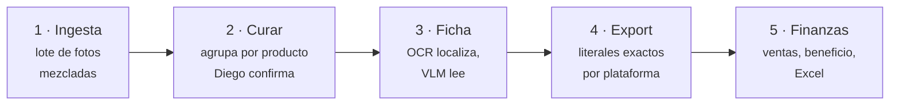

# RESELLERMASTER

**Entra un lote de fotos mezcladas de ropa y trastos de segunda mano. Salen fichas listas para pegar
en Wallapop y Vinted — y la app no afirma ni un solo dato que no pueda señalar en un píxel.**


> **EN — TL;DR.** A local single-user Streamlit app for second-hand resale. It ingests a batch of mixed
> photos, groups them per product (human confirms), reads the attributes with OCR + a vision model, and
> produces copy-paste-ready listings for two Spanish marketplaces. The point isn't the automation — it's
> the **guardrail**: every field carries its provenance (`foto` / `inferido` / `diego`), and a field
> claiming to come from a photo **cannot be constructed without the pixel that proves it** — it raises at
> construction time. Prices never come from the model; they come from observed comparables or they don't
> come at all. Code, docs and commit history are in Spanish.

---

## Qué hace



Los cinco pasos son cinco pantallas. La app **no publica nada**: llega hasta "copiar y pegar", a propósito
(automatizar el formulario va contra los términos de ambas plataformas, y la cuenta *es* el negocio).

## La tesis: la app no afirma, propone — y enseña la prueba

El modo de fallo de esto no es que el código pete. Es que el pipeline **diga con total fluidez que una
sudadera es Nike talla M de algodón** cuando es Adidas, talla S y poliéster, y que eso se publique. Una
ficha mala no es un bug: es una devolución y una reputación quemada en una plataforma donde el rating es
el activo.

Así que cada campo de una ficha lleva, en la estructura de datos y hasta la UI, de dónde salió:

| | |
|---|---|
| `valor` | el dato |
| `fuente` | `foto` · `inferido` · `diego` · `comparable` |
| `evidencia` | qué foto y qué región lo prueba |
| `confianza` | `alta` · `media` · `baja` |

Y la promesa no vive en un prompt ni en un docstring — la fuerza un `if` que revienta al construir el
objeto ([`core/schema.py`](core/schema.py)):

```python
if self.fuente == "foto" and self.evidencia is None:
    raise ValueError(
        "Campo con fuente='foto' sin evidencia: esto es un bug, no un dato..."
    )
```

Un campo que dice venir de la foto sin el píxel que lo respalda **no es que esté desaconsejado: es
inconstruible**. Y `fuente="foto"` sólo se asigna si el valor está *literalmente contenido* en el texto
legible del recorte citado — no basta con que la cita exista
([`core/extract.py::_construir_campo_desde_sintesis`](core/extract.py)). Esa distinción costó un veredicto
bloqueante en una auditoría interna: el modelo podía **extender** una lectura real (`"Reebok"` →
`"Reebok Classic 100% algodón"`) y colarla como leída.

Quien afirma, al final, es el humano: Diego revisa cada campo **con el recorte al lado** y confirma, y ahí
la `fuente` pasa a `diego`. La máquina propone y enseña el píxel; la persona cierra.

## Sobre leer los precios de Wallapop

`core/pricing.py` hace peticiones **de lectura** a la búsqueda pública de Wallapop para calcular la mediana
de comparables. Las condiciones están escritas en las reglas del repo
([`.claude/rules/architecture.md`](.claude/rules/architecture.md)) y se respetan en el código:

- **Leer resultados públicos ≠ publicar.** Nunca se toca una cuenta, no se publica, no se edita, no se
  mensajea. Cero escritura.
- **Volumen doméstico**: ~7 productos por lote, pocos lotes al mes — menos peticiones que una persona
  navegando.
- **Prohibidas las herramientas *stealth*.** Sin proxies rotativos, sin fingerprints, sin evasión
  anti-bot. Es un `GET` plano. Vinted se quedó fuera precisamente por eso: su búsqueda está tras Datadome
  y no se intentó rodearlo.

Si vas a reutilizar esto, la disciplina va con el código.

## Cómo correrlo

```bash
git clone https://github.com/diegollr98-design/resellermaster
cd resellermaster
pip install -r requirements.txt
pytest -q
```

**Qué deberías ver: `890 passed, 15 skipped`, en menos de un minuto, sin API key y sin cuenta en ningún
sitio.**

Los 15 saltados son deliberados y lo dicen en voz alta: el golden set versiona el *ground truth*
([`tests/golden/*.json`](tests/golden/)) pero **no las fotos**, que son mercancía real de Diego y están
gitignored. En su máquina la suite da `904 passed, 1 skipped`. Un skip es visible; un test que pasara sin
los datos mentiría.

Para levantar la app: `streamlit run app.py`. Agrupar y curar es gratis y offline; la extracción de
atributos necesita una `ANTHROPIC_API_KEY` en `.env` (ver [`.env.example`](.env.example)) y cuesta
céntimos, cacheados por hash de imagen.

## Los números, y de dónde sale cada uno

Este repo trata la procedencia de un dato de la ficha con dureza, así que la misma vara se aplica aquí:

| Dato | Valor | Procedencia |
|---|---|---|
| Alucinaciones sobre 33 fotos reales | **0** | **Medido** con la API real. Se abstiene en las 6 trampas ilegibles del golden set |
| Coste por producto | **3,4 cts** (0 al reprocesar) | **Medido** — sale de `LLMEngine.estimar_coste_lote` sobre el pipeline real, no de una estimación a ojo |
| Export de un producto con la app | **~210 s** | **Medido**, cronómetro, **n=1** |
| Export de un producto a mano | ~285 s | **Estimado** por un panel de agentes. **Nunca cronometrado.** El ahorro es real pero el lado manual no está medido |
| Umbral de agrupación | **15 s** | **Medido**: barrido de 5 a 30 s sobre las 33 fotos. Zona segura 1-23 s, acantilado en 24 s |
| Tests | 890 en un clon · 904 con las fotos | Ejecutado |

## Las tres costuras

Tres cosas están centralizadas a propósito, y nada las saltea:

1. **`core/llm.py`** — *toda* llamada a cualquier proveedor pasa por aquí. Contabiliza el coste por
   producto y cachea por hash de imagen. El proveedor es una decisión reversible, no una dependencia
   esparcida por el código.
2. **`core/pricing.py`** — el precio **nunca** sale del modelo. Sale de comparables observados con su URL.
   Sin `n≥5`, o sin un identificador fuerte (marca/modelo), devuelve `precio=None` **con el motivo**, no
   un número plausible. Y lo etiqueta siempre como *"mediana de N artículos parecidos"*, nunca como *"el
   precio de tu producto"* — porque los anuncios publican lo que la gente **pide**, no por cuánto vendió.
3. **`core/schema.py`** — los campos obligatorios de cada plataforma × categoría viven en un sitio,
   declarativo. El modelo **rellena un esquema**; no inventa campos ni se olvida de los obligatorios.
   Wallapop y Vinted no coinciden en los literales de estado ni en las tallas, así que hay tablas de
   mapeo con **signo**: presentar el producto peor de lo que es es seguro; mejor, es una devolución.

## Lo que decidí NO construir (y por qué, con el dato)

Casi tan informativo como lo que sí está:

- **Búsqueda por imagen / Google Lens** — descartada: todas las APIs exigen una URL pública de la imagen y
  esto es una app local. Y hace falta justo donde no funciona: un producto de caja ya se identifica gratis
  por OCR, y una sudadera gris usada no tiene identidad única en internet.
- **CLIP para agrupar por parecido visual** — medido y descartado: **0,90 de similitud entre dos sudaderas
  distintas**, y 0,61 entre el plano general y la etiqueta del *mismo* producto. La señal estaba casi
  invertida. `core/grouping.py` no mira un solo píxel: agrupa por el hueco temporal del EXIF.
- **Un VLM local** — medido: RTX 3050 con 4 GB de VRAM. No entra uno que lea logos y etiquetas.
- **Automatizar la publicación** — prohibido por los términos de ambas plataformas.
- **Auto-fusionar grupos de fotos** — la asimetría manda: partir un producto de más cuesta 5 segundos de
  persona; fusionar dos productos mete una foto de otra prenda en el anuncio y **no lo caza nadie**. La
  pantalla de curado está diseñada para que ese fallo sea *inexpresable*, no meramente "avisado".

## Cómo está construido

Lo levanté solo, con Claude Code, sin saber programar cuando empecé. Ese proceso está versionado y es
parte del repo, no un anexo:

- [`CLAUDE.md`](CLAUDE.md) y [`.claude/rules/`](.claude/rules/) — las reglas que gobiernan el trabajo. La
  central es [`truth-loop.md`](.claude/rules/truth-loop.md): cómo se impide que el pipeline invente.
- [`.claude/incident-ledger.md`](.claude/incident-ledger.md) — **32 incidentes propios**, append-only, con
  evidencia y clase. No es un diario de bugs: es de dónde salen las reglas. Dos que valen la pena:
  - **`[INC-031]`** — 900 tests en verde no vieron que la síntesis fallaba con un 400 de esquema en *toda*
    re-extracción, porque los tests mockean el motor y descartan el `json_schema` que nunca llega a la API
    real. *Verde local ≠ funciona.*
  - **`[INC-005]`** — la confianza estaba **anti-correlacionada con el riesgo**: el sistema emitía
    `confianza=alta` cuando el hueco temporal era pequeño… y una fusión errónea *la causa* un hueco
    pequeño. El output más peligroso salía con la etiqueta que la UI confirma en bloque sin mirar.
- [`docs/seeds/`](docs/seeds/) — los handoffs entre sesiones, uno por fase.

---

**Licencia:** [MIT](LICENSE) · **Autor:** Diego Tomás Llopis

App local de un solo usuario, escrita para un caso real y usada en producción por una persona: yo. No es
un producto ni pretende serlo.
