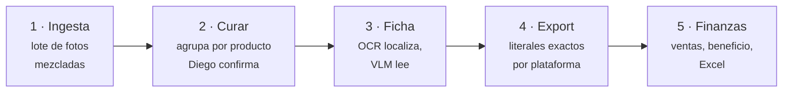

# RESELLERMASTER

**Entra un lote de fotos mezcladas de ropa y trastos de segunda mano. Salen fichas listas para pegar
en Wallapop y Vinted — y ningún campo dice venir de una foto sin que un `if` haya comprobado el
píxel que lo prueba.**


<sub>Tres campos del mismo producto: `marca` es una **conjetura marcada** (🧠, confianza baja, *«sin etiqueta que lo respalde»*), mientras que `modelo` y `ean` están **leídos de un píxel concreto** (📷) y el recorte que lo prueba está ahí al lado. El `ean` es el único campo del sistema que puede llegar a `confianza alta`, y sólo porque su checksum GS1 lo verifica.</sub>

> **EN — TL;DR.** A local single-user Streamlit app for second-hand resale. It ingests a batch of mixed
> photos, groups them per product (human confirms), reads the attributes with OCR + a vision model, and
> produces copy-paste-ready listings for two Spanish marketplaces. The point isn't the automation — it's
> the **guardrail**: every field carries its provenance (`foto` / `inferido` / `diego`), and a field
> claiming to come from a photo **cannot be constructed without the pixel that proves it** — it raises in
> `__post_init__`. (Scope, stated honestly: that guards construction, which is how everything the pipeline
> produces gets in; it is not a global invariant.) Prices never come from the model; they come from observed comparables or they don't
> come at all. Code, docs and commit history are in Spanish.

---

## Qué hace



Los cinco pasos son cinco pantallas. La app **no publica nada**: llega hasta "copiar y pegar", a propósito
(automatizar el formulario va contra los términos de ambas plataformas, y la cuenta *es* el negocio).

## La tesis: la app no afirma, propone — y enseña la prueba

El modo de fallo de esto no es que el código pete. Es que el pipeline **diga con total fluidez que una
sudadera es Nike talla M de algodón** cuando es Adidas, talla S y poliéster, y que eso se publique. Una
ficha mala no es un bug: es una devolución y una reputación quemada en una plataforma donde el rating es
el activo.

Así que cada campo de una ficha lleva, en la estructura de datos y hasta la UI, de dónde salió:

| | |
|---|---|
| `valor` | el dato |
| `fuente` | `foto` · `inferido` · `diego` · `comparable` |
| `evidencia` | qué foto y qué región lo prueba |
| `confianza` | `alta` · `media` · `baja` |

Y la promesa no vive en un prompt ni en un docstring — la fuerza un `if` que revienta al construir el
objeto ([`core/schema.py`](core/schema.py)):

```python
if self.fuente == "foto" and self.evidencia is None:
    raise ValueError(
        "Campo con fuente='foto' sin evidencia: esto es un bug, no un dato..."
    )
```

Un campo que dice venir de la foto sin el píxel que lo respalda **no está desaconsejado: no se puede
construir**. Y `fuente="foto"` sólo se asigna si el valor aparece **como token completo** en el texto
legible del recorte citado — no basta con que la cita exista, ni con que el valor sea una subcadena
cualquiera ([`core/extract.py::_construir_campo_desde_sintesis`](core/extract.py)). Esa distinción costó
un veredicto bloqueante en una auditoría interna: el modelo podía **extender** una lectura real
(`"Reebok"` → `"Reebok Classic 100% algodón"`) y colarla como leída. Y una auditoría externa encontró
después que la comprobación seguía siendo una subcadena desnuda, así que una talla de una letra pasaba
contra una etiqueta que no la dice (`"M"` dentro de `"ORIGINAL MARINES"`): por eso ahora se exige el
token, con su test.

Quien afirma, al final, es el humano: Diego revisa cada campo **con el recorte al lado** y confirma, y ahí
la `fuente` pasa a `diego`. La máquina propone y enseña el píxel; la persona cierra.

**Hasta dónde llega esa garantía, dicho sin adornos.** El `if` protege la *construcción*, que es por donde
entra todo lo que produce el pipeline. No es un invariante global: `Campo` es un dataclass mutable, así que
alguien puede construirlo bien y reasignar `fuente` después; y al persistir, `deserializar_extraccion`
devuelve dicts, no `Campo`s, de modo que un registro manipulado a mano en la base de datos no vuelve a pasar
por el `if`. Hoy nadie escribe por esas vías —sólo escribe el pipeline, que sí construye `Campo`s— así que
es un hueco de defensa en profundidad, no un fallo vivo. Pero es una propiedad de una función, no del
sistema entero, y decirlo de más sería justo el tipo de afirmación que este repo existe para no hacer.

## Cómo correrlo

```bash
git clone https://github.com/diegollr98-design/resellermaster
cd resellermaster
pip install -r requirements.txt
pytest -q
```

**Qué deberías ver: `892 passed, 15 skipped`, en menos de un minuto, sin API key y sin cuenta en ningún
sitio.**

Los 15 saltados son deliberados y lo dicen en voz alta: el golden set versiona el *ground truth*
([`tests/golden/*.json`](tests/golden/)) pero **no las fotos**, que son mercancía real de Diego y están
gitignored. En su máquina la suite da `906 passed, 1 skipped`. Un skip es visible; un test que pasara sin
los datos mentiría.

Para levantar la app: `streamlit run app.py`. Agrupar y curar es gratis y offline; la extracción de
atributos necesita una `ANTHROPIC_API_KEY` en `.env` (ver [`.env.example`](.env.example)) y cuesta
céntimos, cacheados por hash de imagen.

## Sobre leer los precios de Wallapop

`core/pricing.py` hace peticiones **de lectura** a la búsqueda pública de Wallapop para calcular la mediana
de comparables. Las condiciones están escritas en las reglas del repo
([`.claude/rules/architecture.md`](.claude/rules/architecture.md)) y se respetan en el código:

- **Leer resultados públicos ≠ publicar.** Nunca se toca una cuenta, no se publica, no se edita, no se
  mensajea. Cero escritura.
- **Volumen doméstico**: ~7 productos por lote, pocos lotes al mes — menos peticiones que una persona
  navegando.
- **Prohibidas las herramientas *stealth*.** Sin proxies rotativos, sin fingerprints, sin evasión
  anti-bot. Es un `GET` plano. Vinted se quedó fuera precisamente por eso: su búsqueda está tras Datadome
  y no se intentó rodearlo.

Si vas a reutilizar esto, la disciplina va con el código.

## Los números, y de dónde sale cada uno

Este repo trata la procedencia de un dato de la ficha con dureza, así que la misma vara se aplica aquí:

| Dato | Valor | Procedencia |
|---|---|---|
| Alucinaciones con `confianza=alta` sobre 33 fotos reales | **0** | **Medido** con la API real — pero léelo con su límite: `alta` es casi inalcanzable **por diseño** (sólo la da un checksum de EAN; el `json_schema` de la síntesis ni admite el literal). El 0 es sobre todo una consecuencia estructural, no un resultado empírico sorprendente. Las de confianza media/baja se imprimen pero no se asertan |
| Coste por producto, **facturado** | **14,5 cts** el lote de 62 llamadas · **0,95 cts** un producto completo con síntesis · **0** al reprocesar (caché) | **Medido**: es lo que cobró la API |
| Coste por producto, **estimado a priori** | ~3,4 cts | **Estimado**, y sobreestima ~1,3×. Sale de `LLMEngine.estimar_coste_lote`, que multiplica una constante de 1.600 tokens/imagen y **no llama a la API** — existe para enseñar el coste ANTES de lanzar un lote, no para medirlo |
| Export de un producto con la app | **~210 s** | **Medido**, cronómetro, **n=1** |
| Export de un producto a mano | ~285 s | **Estimado** por un panel de agentes. **Nunca cronometrado.** El ahorro es real pero el lado manual no está medido |
| Umbral de agrupación | **15 s** | **Medido**: barrido de 5 a 30 s sobre las 33 fotos. Zona segura 1-23 s, acantilado en 24 s |
| Tests | 891 en un clon · 905 con las fotos | Ejecutado |

## Las tres costuras

Tres cosas están centralizadas a propósito, y nada las saltea:

1. **`core/llm.py`** — *toda* llamada a cualquier proveedor pasa por aquí. Contabiliza el coste por
   producto y cachea por hash de imagen. El proveedor es una decisión reversible, no una dependencia
   esparcida por el código.
2. **`core/pricing.py`** — el precio **nunca** sale del modelo. Sale de comparables observados con su URL.
   Sin `n≥5`, o sin un identificador fuerte (marca/modelo), devuelve `precio=None` **con el motivo**, no
   un número plausible. Y lo etiqueta siempre como *"mediana de N artículos parecidos"*, nunca como *"el
   precio de tu producto"* — porque los anuncios publican lo que la gente **pide**, no por cuánto vendió.
3. **`core/schema.py`** — los campos obligatorios de cada plataforma × categoría viven en un sitio,
   declarativo. El modelo **rellena un esquema**; no inventa campos ni se olvida de los obligatorios.
   Wallapop y Vinted no coinciden en los literales de estado ni en las tallas, así que hay tablas de
   mapeo con **signo**: presentar el producto peor de lo que es es seguro; mejor, es una devolución.

## La persistencia, que es donde vive el dinero

`core/store.py` (SQLite + disco) tiene tres decisiones que no son obvias y que existen porque el fallo caro
aquí es **perder o corromper**, no petar:

- **El beneficio de una venta se congela al venderla.** El coste se copia a `coste_snap_cents` en el
  momento de la venta, así que editar el coste del producto después **no reescribe el histórico**. Probado
  a mano: cambiar el coste tras vender no altera el beneficio ya registrado.
- **El número de referencia es una marca de agua**, no un `MAX()+1`: una tabla `AUTOINCREMENT` propia. Si
  borras o archivas un producto, su número **no se reutiliza** — el que está impreso en un anuncio vivo
  sigue siendo único.
- **El dinero vive en columnas propias**, fuera del JSON `campos` que `guardar_extraccion` sobreescribe
  entero. Y `borrar_lote` **se bloquea** si el lote tiene ventas, antes de tocar el disco.

`st.session_state` es una caché, nunca la verdad: el estado del lote se escribe a disco, porque un rerun de
Streamlit no puede costar dos horas de curado.

## Lo que decidí NO construir (y por qué, con el dato)

Casi tan informativo como lo que sí está:

- **Búsqueda por imagen / Google Lens** — descartada: todas las APIs exigen una URL pública de la imagen y
  esto es una app local. Y hace falta justo donde no funciona: un producto de caja ya se identifica gratis
  por OCR, y una sudadera gris usada no tiene identidad única en internet.
- **CLIP para agrupar por parecido visual** — medido y descartado: **0,90 de similitud entre dos sudaderas
  distintas**, y 0,61 entre el plano general y la etiqueta del *mismo* producto. La señal estaba casi
  invertida. `core/grouping.py` no mira un solo píxel: agrupa por el hueco temporal del EXIF.
- **Un VLM local** — medido: RTX 3050 con 4 GB de VRAM. No entra uno que lea logos y etiquetas.
- **Automatizar la publicación** — prohibido por los términos de ambas plataformas.
- **Auto-fusionar grupos de fotos** — la asimetría manda: partir un producto de más cuesta 5 segundos de
  persona; fusionar dos productos mete una foto de otra prenda en el anuncio y **no lo caza nadie**. La
  pantalla de curado está diseñada para que ese fallo sea *inexpresable*, no meramente "avisado".

## Cómo está construido

Lo levanté solo, con Claude Code, sin saber programar cuando empecé. Ese proceso está versionado y es
parte del repo, no un anexo:

- [`CLAUDE.md`](CLAUDE.md) y [`.claude/rules/`](.claude/rules/) — las reglas que gobiernan el trabajo. La
  central es [`truth-loop.md`](.claude/rules/truth-loop.md): cómo se impide que el pipeline invente.
- [`.claude/incident-ledger.md`](.claude/incident-ledger.md) — **36 incidentes propios**, append-only, con
  evidencia y clase. No es un diario de bugs: es de dónde salen las reglas. Dos que valen la pena:
  - **`[INC-031]`** — 900 tests en verde no vieron que la síntesis fallaba con un 400 de esquema en *toda*
    re-extracción, porque los tests mockean el motor y descartan el `json_schema` que nunca llega a la API
    real. *Verde local ≠ funciona.*
  - **`[INC-005]`** — la confianza estaba **anti-correlacionada con el riesgo**: el sistema emitía
    `confianza=alta` cuando el hueco temporal era pequeño… y una fusión errónea *la causa* un hueco
    pequeño. El output más peligroso salía con la etiqueta que la UI confirma en bloque sin mirar.
- [`docs/seeds/`](docs/seeds/) — los handoffs entre sesiones, uno por fase.

---

**Licencia:** [MIT](LICENSE) · **Autor:** Diego Tomás Llopis

App local de un solo usuario, escrita para un caso real y usada en producción por una persona: yo. No es
un producto ni pretende serlo.
